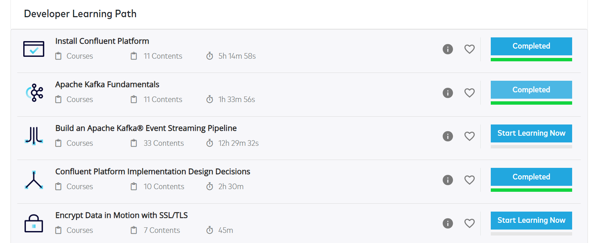
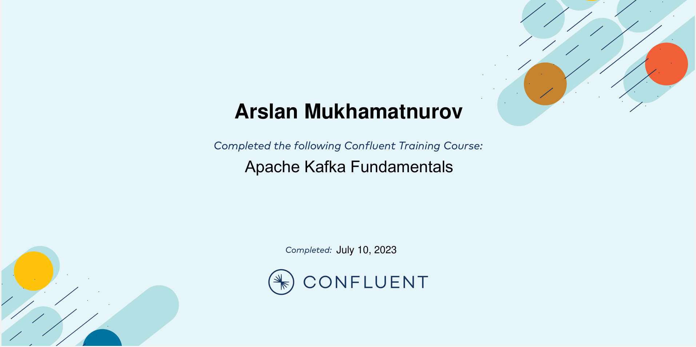
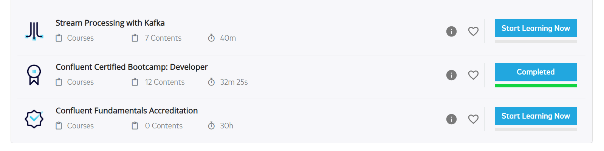
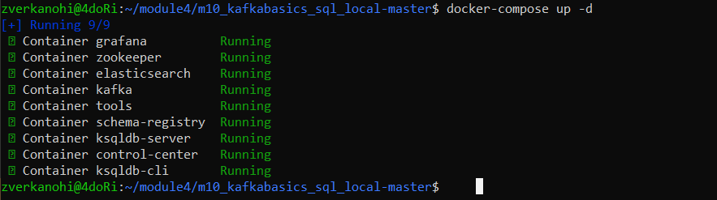
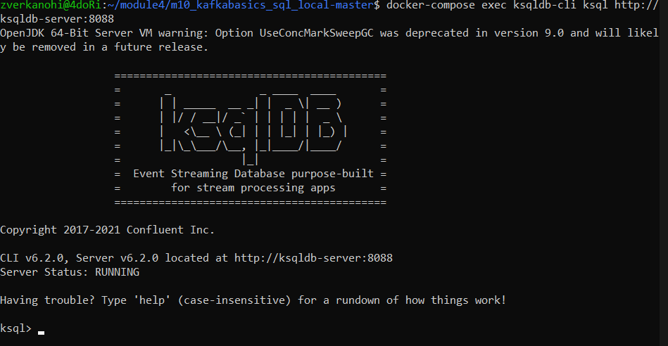
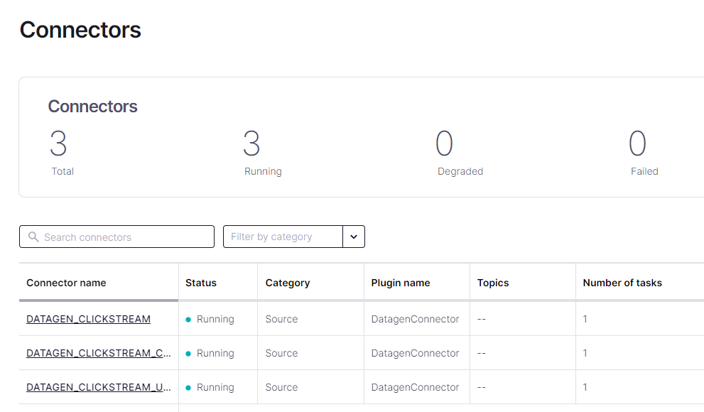
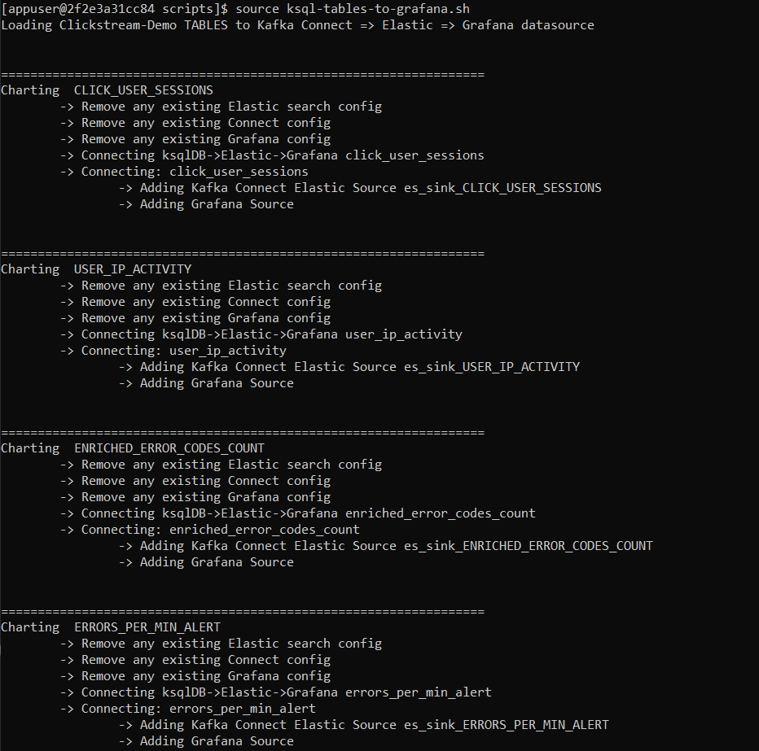
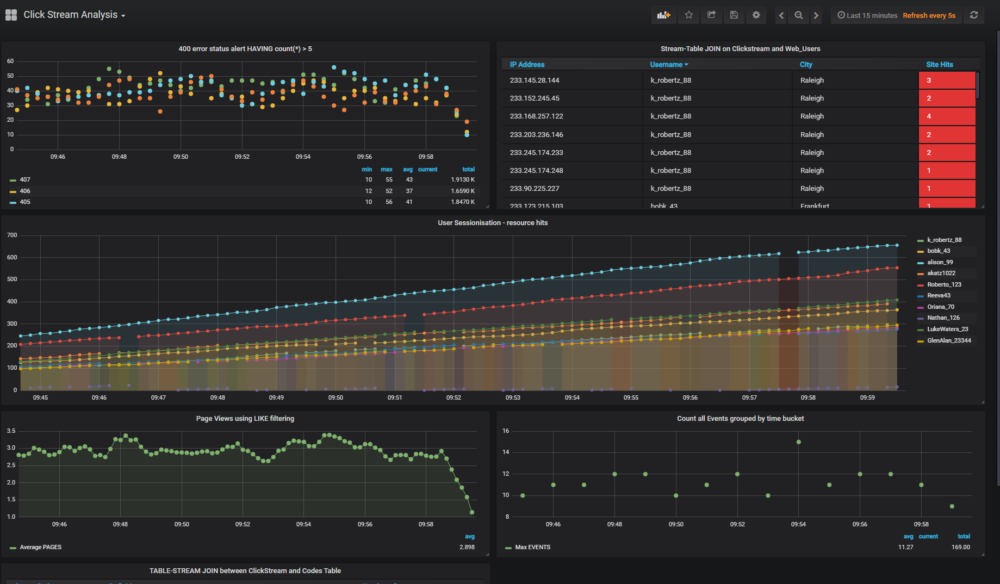
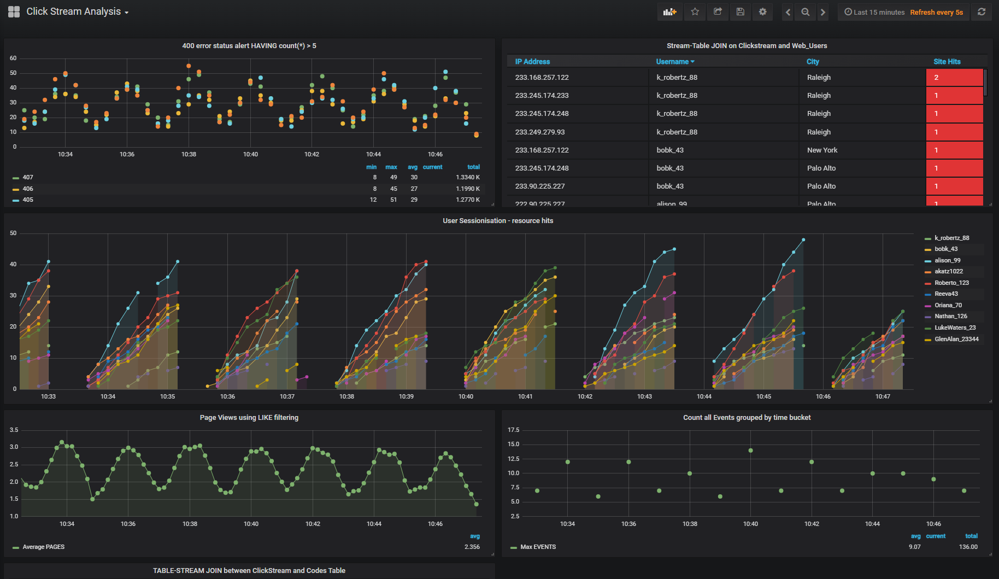
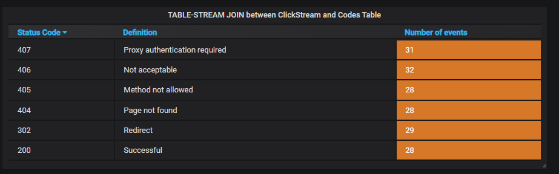

# Module 4: Kafka Basics

In this module, we have explored:
- What is a Kafka and why do we need it
- How it works
- Basic components of Kafka: Producer, Consumer, Broker, Topics, Partitions, and Replication.
- For what purpouse do we need ZooKeeper
- In Developers learning path on partners.confluent we got acuinted with the of methods of integrating Kafka int the Environment: REST-proxy, Shcema-Registry, Kafka Connect, Kafka Streams, KSQL, and Confluent Control Center. 

# Conluent developer path certificates and screenshots

- Install Confluent Platform
- Apache Kafka Fundamentals
- Confluent Platform Implementation Design Decisions

- Confluent Certified Bootcamp: Developer

# Given data:

1. Repository on git.epam
2. Detailed documentation for running the example on docs.confluent

# Tasks:

1. Run docker containers
2. Run scripts on those containers 
3. Check the output on a browser

# Detailed description of the work done by me

1. Download project directory: https://git.epam.com/epmc-bdcc/trainings/bd201/m10_kafkabasics_sql_local
2. Run the command:
---
    sudo sysctl -w vm.max_map_count=262144

- Elasticsearch uses memory-mapped files for better performance. Memory-mapped file allow Elasticsearch to use virtual memory as if it were disk sapce, which enables it to handle large data sets efficiently. Thats why, vm.max_map_count kernel parameter needs to be set to a value that is large enough. Default value is usually low. 
3. Download jar files for kafka-connect-datagen and kafka-connect-elasticsearch using commands:
---
    docker run -v $PWD/confluent-hub-components:/share/confluent-hub-components confluentinc/ksqldb-server:0.8.0 confluent-hub install --no-prompt confluentinc/kafka-connect-datagen:0.4.0

    docker run -v $PWD/confluent-hub-components:/share/confluent-hub-components confluentinc/ksqldb-server:0.8.0 confluent-hub install --no-prompt confluentinc/kafka-connect-elasticsearch:10.0.2

4. Proceed to the project folder

4. Download and run docker containers:
---
    docker-compose up -d

- -d flag is used to run the command in a detached mode (background)
- Output:

6. After some peiod of time (5 min) launch the ksqlDB CLI:
---
    docker-compose exec ksqldb-cli ksql http://ksqldb-server:8088
- Output: 

---
7. Create three source connectors for generating mock data (clickstream, clickstream_codes, clickstream_users):
---
    RUN SCRIPT '/scripts/create-connectors.sql';
8. Go to Confluent control Center UI at http://localhost:9021 and view created connectors: 

9. Load the Streaming Data to ksqlDB. For this purpose we run statemnts.sql file that runs the tutorial app:
---
    RUN SCRIPT '/scripts/statements.sql';
10. Verify the data in CCC UI 
- Flow
- KSQL Query
11. Load the Clickstream Data in Grafana:
- For this part first of all we need to give an execution permission to all sh files in '/scripts' folder:
---
    docker-compose exec elasticsearch bash
    cd /scripts
    chmod +x *.sh
    exit
12. Set up the required Elasticsearch document mapping template
---
    docker-compose exec elasticsearch bash -c '/scripts/elastic-dynamic-template.sh'
13. Send the ksqlDB tables to Elasticsearch and Grafana:
---
    docker-compose exec ksqldb-server bash -c '/scripts/ksql-tables-to-grafana.sh'

14. Load the dashboard into Grafana.
---
    docker-compose exec grafana bash -c '/scripts/clickstream-analysis-dashboard.sh'
15. Navigate to Grafana dashboard at http://localhost:3000. Username and password: user, user. Then navigate to the Clicksream Analysis Dashboard: 

16. Sessionaize the data. CLICK_USER_SESSIONS table shows a user activity. If a user is inactive for 30 seconds, then any further users activity is counted as a new session. In this part we run script which will stop user activity for 35 seconds every 90 sec:
- in project folder run the cript
---
    ./sessionize-data.sh

Grafana Dashboard: 

# Useful commands
---
    docker-compose exec -u root <container> bash

    

