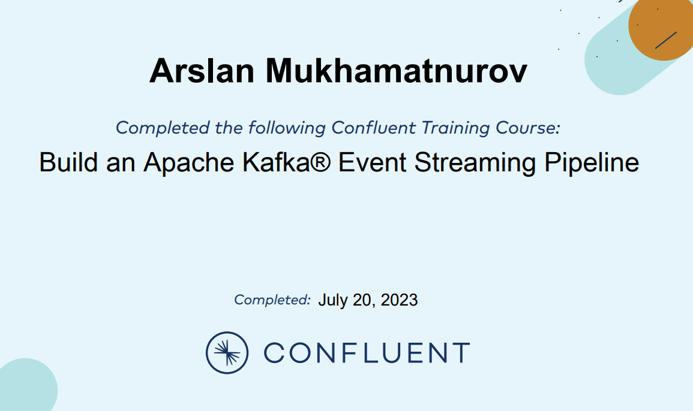
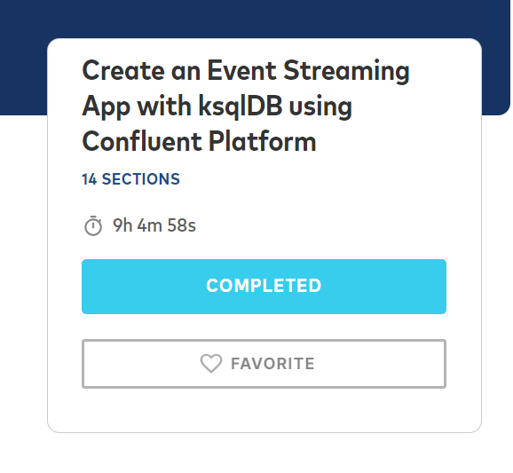
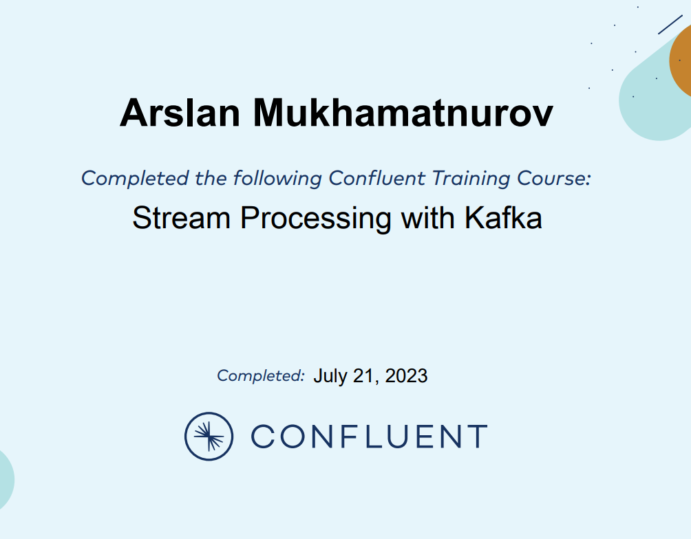
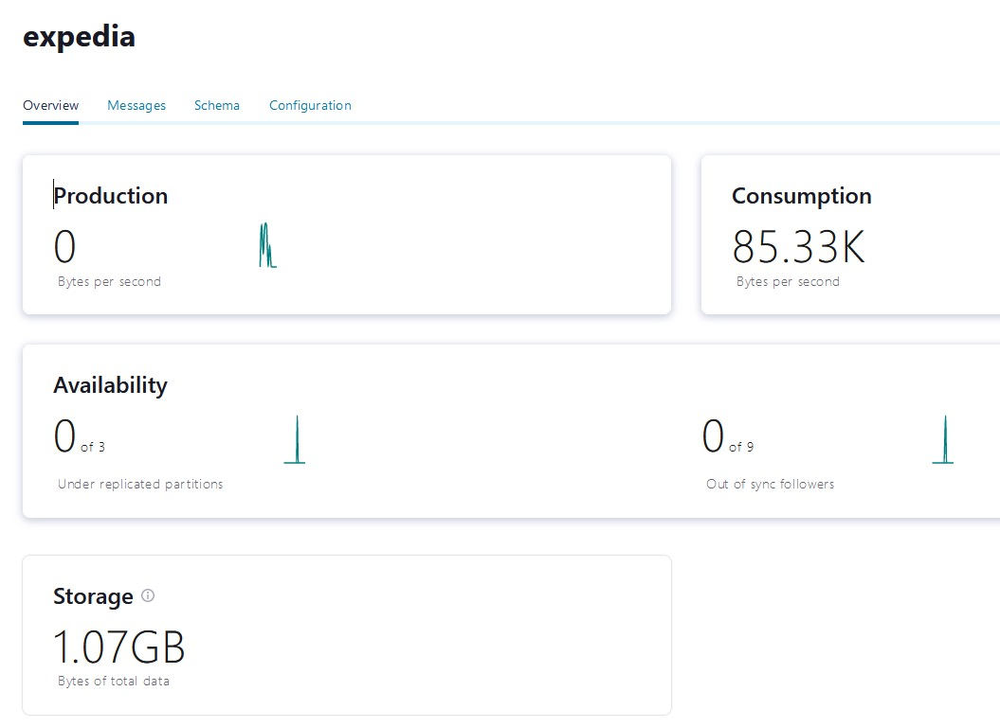
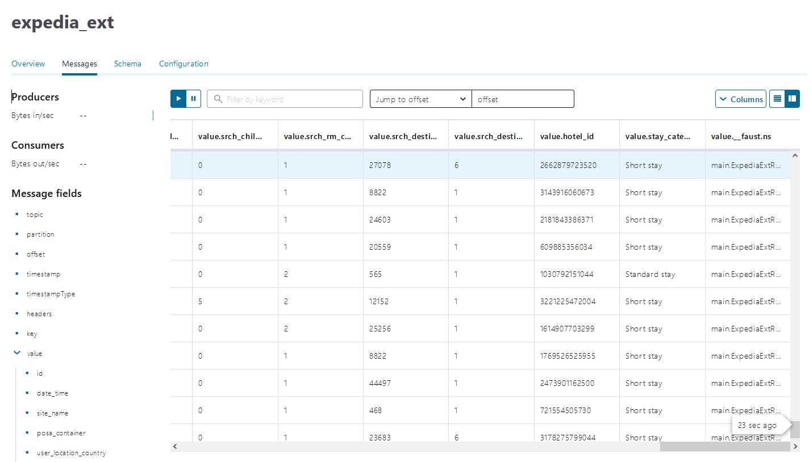
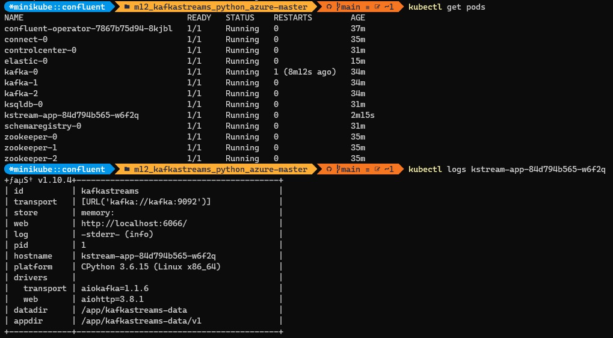
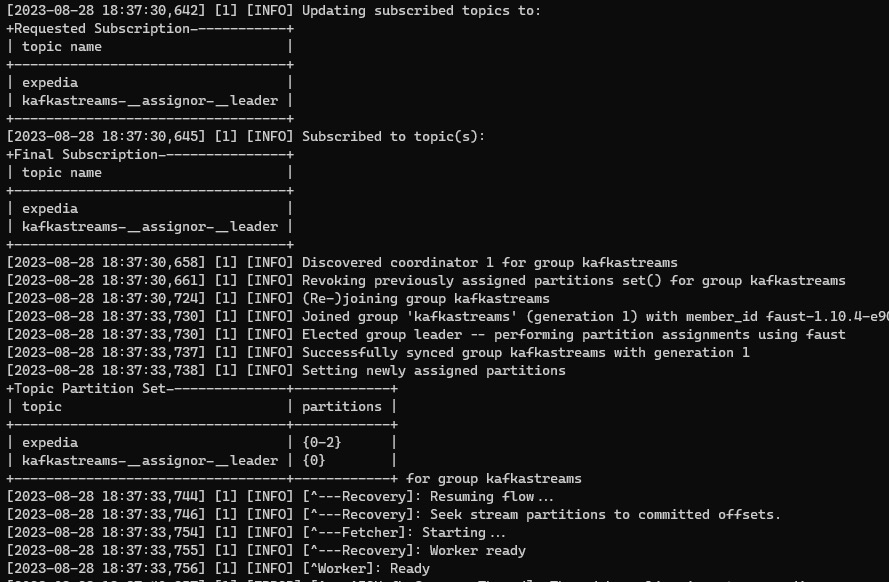

# Module 6: Kafka Streams

In this module, we have expolred:

- How to work with Kafka Streams framework
- How to enrich data in streaming applications
- Get familliar with KSQL

This module is kind of continue of the previous module with additional streaming application

# Tasks:

#### 1. Complete modules in Confluent Developer path
#### 2. Create Azure Blob Storage Kafka Connect image in Docker Hub
#### 3. Deploy AKS on Azure
#### 4. Deploy Kafka in AKS
#### 5. Create Topic, Set Kafka Connect
#### 6. Write Kafka Streams job to read data from "expedia" topic, modify it and store enriched data in "expedia_ext" topic
#### 7. Visualize data in KSQL. Show total amount of hotels and number of distinct hotels for each category. 

## 1. Completed modules in Confluent

### Confluent developer path certificates and screenshots

- Build an Apache Kafka® Event Streaming Pipeline

- Create an Event Streaming App with ksqlDB using Confluent Platform

- Stream Processing with Kafka

## Create Azure Blob Storage 

1. Run docker
2. Sign in to docker
3. Go to ./connectors
4. run docker commands:
---
    docker build -f docker/Dockerfile .
    # check docker image
    docker image list
    docker image tag <image_id> <your_docker_hub_id>/my-azure-connector:1.0.0
    # upload image to Docker Hub
    docker push <your_docker_hub_id>/my-azure-connector:1.0.0

## 3. Deploy AKS

1. Create storage account in Azure portal
2. Write down Azure storage account credentials to main.tf file(./terraform/)
3. For deploying and running Kafka on AKS without delays and errors change "vm_size" to: "Standard_D8_v3".
4. Deploy AKS and storage via terraform:
---
    terraform init
    terraform plan -out terraform.plan
    terraform apply terraform.plan

## 4. Deploy Kafka in AKS

1. Install az cli (if you dont have)
2. Install helm (if you dont have)
3. Change Kafka Connect Image in confluent-platform.yaml: 
  from "my-azure-connector:1.0.0" to "<docker-id>/my-azure-connector:1.0.0"
3. Login to az cli.
3. run "set-up-aks-confluent.ps1" powerShell script file. Contents:
---
    # get AKS credentials to set up kubectl (Kubernetes cli)

    az aks get-credentials --resource-group rg-m5-westeurope --name aks-m5-westeurope

    # set up confluent platform in AKS

    kubectl create namespace confluent
    kubectl config set-context --current --namespace confluent
    helm repo add confluentinc https://packages.confluent.io/helm
    helm repo update
    helm upgrade --install confluent-operator confluentinc/confluent-for-kubernetes

    # deploy Kafka in AKS

    kubectl apply -f confluent-platform.yaml
    kubectl apply -f producer-app-data.yaml

  4. Wait till all pods are ready via kubectl command:
  ---
      kubectl get pods
      or
      kubectl get pods -w 

  5. Upload "topic" file from "m12kafkastreams" to "data"container

  ## 5. Create Topic, Set Kafka Connect, Run The Job

  1. Change "azure-source-cc-expedia.json" file (without comments):

    # write down your Azure Blob Storage credentials:
    # transforms made by Kafka Connecter before uploading messages into Kafka
    # mask time from the date field using MaskField transformer

      {
      "name" : "AzureBlobStorageSourceConnector",
      "config" : {
        "connector.class" : "io.confluent.connect.azure.blob.storage.AzureBlobStorageSourceConnector",
        "tasks.max" : "1",
        "azblob.account.name" : "",
        "azblob.account.key" : "",
        "azblob.container.name" : "",
        "format.class" : "io.confluent.connect.azure.blob.storage.format.avro.AvroFormat",
        "confluent.topic.bootstrap.servers" : "kafka:9092",
        "confluent.topic.replication.factor" : "3",
        "transforms" : "MaskSensitiveFields",
        "transforms.MaskSensitiveFields.type" : "org.apache.kafka.connect.transforms.MaskField$Value",
        "transforms.MaskSensitiveFields.fields" : "date_time",
        "transforms.MaskSensitiveFields.replacement" : "0000-00-00 00:00:00"
      }
    }

3. Run "start_connector.ps1" file to create Topic, schema, and connector:
---
    # create topic
    
    kubectl exec kafka-0 -- kafka-topics --create  --topic expedia --partitions 3 --replication-factor 3 --bootstrap-server kafka:9092 
    kubectl exec kafka-0 -- kafka-topics --create  --topic expedia_ext --partitions 3  --replication-factor 3  --bootstrap-server kafka:9092 

    # configure and start connector for Azure Blob Storage

    kubectl cp .\connectors\azure-source-cc-expedia.json confluent/connect-0:/opt
    kubectl exec connect-0 -- curl -s -X POST -H 'Content-Type: application/json' --data @azure-source-cc-expedia.json http://localhost:8083/connectors

"expedia" topic : 

## 6 Create Kafka Streams application

1. Create kstream application in python:
 - code in "./src/main.py"
 - I have created "duration_categories" wich will choose category depending on stay duration.
 - Then old topic will be enriched with "stay_category" column.
2. Create docker file:
---
    docker build -f docker/Dockerfile .
    # check docker image
    docker image list
    docker image tag <image_id> <your_docker_hub_id>/kstream-app:1.0.0
    # upload image to Docker Hub
    docker push <your_docker_hub_id>/kstream-app:1.0.0
3. Modify "kstream-app.yaml" file:
    - write image in container field 
4. deploy container in AKS:
---
    kubctl apply -f kstream-app.yaml

"expedia_ext" topic : 

Working pods in AKS:

Kstream application logs:

## 7. Visualize data in KSQL

1. Run KSQL cli:
---
    kubectl exec --stdin --tty ksqldb-0 -- /bin/bash

2. Create stream:
---
    CREATE STREAM expedia_ext_stream (hotel_id INT, category STRING, other_columns...) 
    WITH (KAFKA_TOPIC='expedia_ext', VALUE_FORMAT='AVRO');

3. Create table:
---
    CREATE TABLE hotel_aggregation AS 
    SELECT category, COUNT(hotel_id) AS total_hotels, COUNT(DISTINCT hotel_id) AS distinct_hotels 
    FROM expedia_ext_stream 
    GROUP BY stay_category;

4. Screenshots:
 
- Unfortunately, I cannot provide screenshots for the final task due to a technical issue with my project. It seems that the issue comes from the Azure platform.

- Error Description:
When I attempt to create an Azure blob storage connector, I receive a message indicating successful creation. However, neither the control center nor the connector pod shows a working connector.
