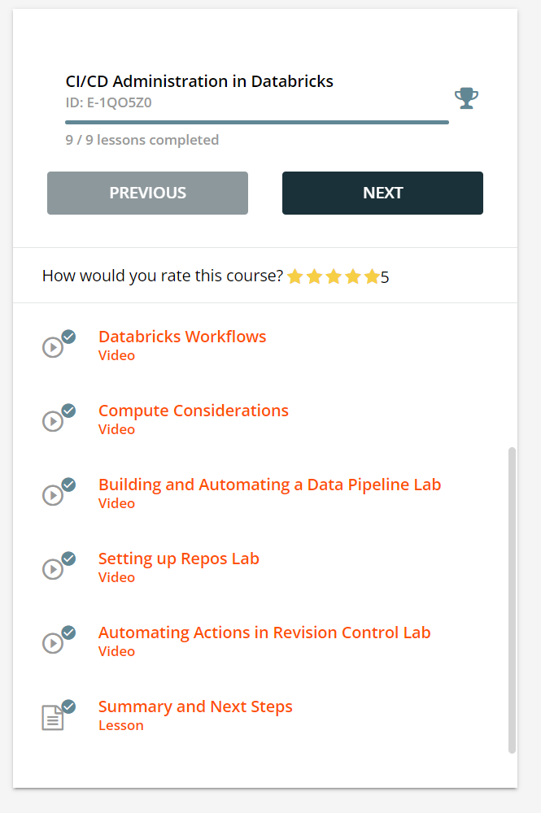
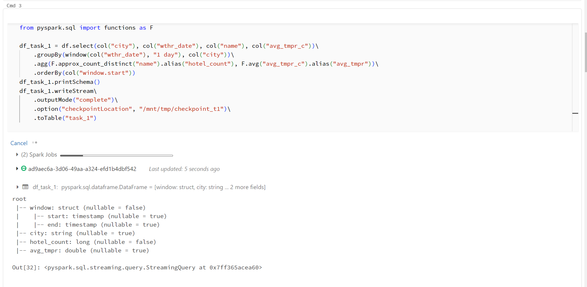
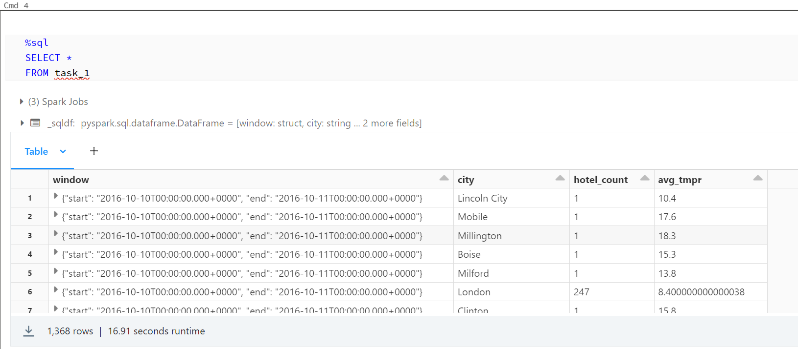
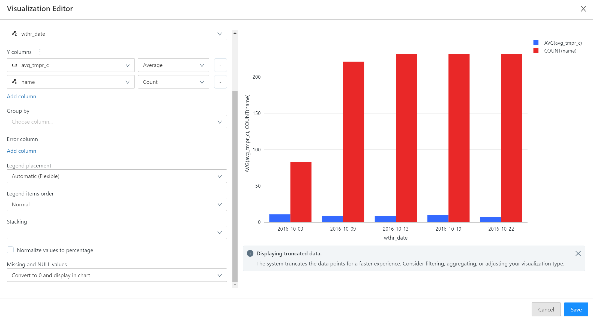

# Module 7: Spark Streaming

In this module, we have explored:

- What is Structured Streaming in Spark and how to work with it
- How to conduct Streaming processess on Databricks
- Deployed Databricks in Azure cloud
- Simulated Streaming source application

# Tasks:

#### 1. Complete modules in Confluent Developers path
#### 2. Deploy storage account and Databricks application in Azure via Terraform
#### 3. Write 2 Notebooks for Databricks:
 - One for Streaming Simulation
 - Second for Structured Streaming application
#### 4. Push the project to the cloud

## 1. Completed modules in Confluent

 - CI/CD Administration in Databricks
   

 - Structured Streaming
   

## 2. Deploy storage account and Databricks application in Azure via Terraform

1. Create storage account in Azure portal
2. Write down Azure storage account credentials to main.tf file(./terraform/)
4. Deploy Databricks and storage acc for ADLS gen 2 via terraform:
---
    terraform init
    terraform plan -out terraform.plan
    terraform apply terraform.plan

## 3. Write 2 Notebooks for Databricks:

Notebooks you can find in ./notebooks/ folder

#### Screenshots:
- Using Spark calculate in Databricks Notebooks for each city each day:
    - Number of distinct hotels in the city.
    - Average/max/min temperature in the city.

- Visualize incoming data in Databricks Notebook for 10 biggest cities (the biggest number of hotels in the city, one chart for one city):
    - X-axis: date (date of observation).
    - Y-axis: number of distinct hotels, average/max/min temperature.

To visualize tables I have used built-in functin: "Visualize"

## 4. Push the project to the cloud
- download databricks cli and log in
- craete .env file with OAuth credentials
- create "create-cluster-temp.json" file which comprises Databricks - clusters characteristiks.
- create "databricks.sh" file. It consist of theree blocks: export credentials into the environment, import authentication variables to json file, import authentication variables to main.tf (terraform), and create cluster and deploy databricks notebook. (for details check ./databricks.sh)
- Run Databricks Notebook in Databricks.

## Tips:
 - You can create and run the project in free community version
